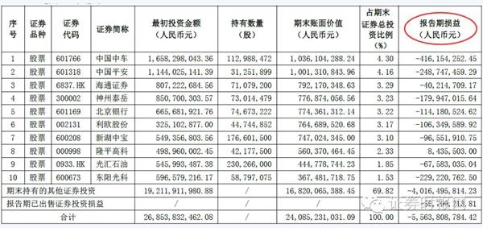

究竟是什么股票让中信证券亏了这么多？来看看中信证券的前十大重仓股。

　　首当其冲的是中国中车(8.680, -0.09, -1.03%)（601766，SH），中信证券持有1.13亿股，占中信证券证券总投资比例的4.3%，这也是中信证券亏损最多的一只个股，报告期损益为-4.16亿元。

　　接下来亏损额较大的是中国平安（601318，SH）、东阳光科（600673，SH）等，报告期亏损额分别达到了2.49亿元和2.29亿元。

　　中信证券所持股票单只亏损额超过1亿元的还有神州泰岳(5.620, -0.18, -3.10%)（300002，SZ）、北京银行(6.180, -0.04, -0.64%)（601169，SH）、利欧股份(2.320, -0.04, -1.69%)（002131，SZ）等。

　　此外，中信证券还重仓了两只港股，分别为海通证券(10.180, -0.12, -1.17%)（06837）及光汇石油（00933），也分别亏损了4021万元及6758万元。

　　在中信证券十大重仓股中，仅有隆平高科(20.510, -0.35, -1.68%)（000998，SZ）实现了844万元的盈利。

http://finance.eastmoney.com/news/1349,20160827658797486.html

http://finance.sina.com.cn/stock/quanshang/qsyj/2016-08-26/doc-ifxvitex8988252.shtml